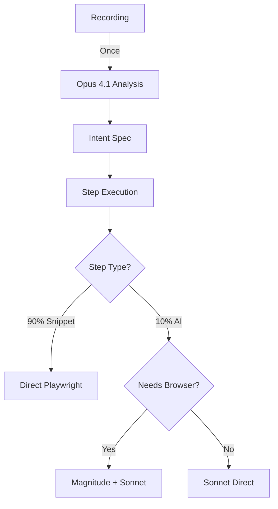

# Dual-Model Architecture Documentation

## Overview
The system now uses a dual-model approach to optimize performance and cost:
- **Claude Opus 4.1**: Complex analysis and Intent Spec generation
- **Claude Sonnet 4**: Runtime AI actions during execution

## Model Usage Breakdown

### Claude Opus 4.1 - Analysis Phase
**When**: Once per recording analysis  
**Purpose**: Complex reasoning, pattern recognition, and planning  
**Used In**: `llm.ts::analyzeRecording()`

```javascript
// Via Claude Code SDK (worker process)
analyzeRecording(recordingData) → Intent Spec with 90% snippets
```

**Why Opus for Analysis?**
- Understands complex user intent from recordings
- Creates structured automation plans
- Generates reliable Playwright snippets
- Identifies skip conditions and error recovery strategies
- Higher accuracy for one-time analysis justifies the cost

### Claude Sonnet 4 - Execution Phase
**When**: During automation execution (10% of steps)  
**Purpose**: Simple runtime decisions and actions  
**Used In**: `enhanced-magnitude-controller.ts::executeWithAI()`

```javascript
// Direct API call for simple decisions
executeRuntimeAIAction("verify total matches expected") → quick validation

// Via Magnitude for browser control
magnitudeAgent.act("click the newest invoice") → browser interaction
```

**Why Sonnet for Runtime?**
- 3-5x faster response time than Opus
- 60-80% cheaper per token
- Sufficient for simple tasks like:
  - Finding dynamic elements
  - Content validation
  - Basic decision making
  - Error recovery actions

## Execution Flow



## Cost & Performance Analysis

### Typical Flow (100 steps)
```
Analysis Phase:
- 1x Opus call: ~$0.15 (one-time)

Execution Phase (100 steps):
- 90 snippet steps: $0 (no AI)
- 10 AI steps with Sonnet: ~$0.02
- Total execution: ~$0.02

Total Cost: ~$0.17
vs All-Opus: ~$1.50 (88% cost reduction)
```

### Performance Metrics
```
Opus 4.1 (Analysis):
- Latency: 3-5 seconds
- Used: 1x per recording
- Impact: Minimal (one-time)

Sonnet 4 (Runtime):
- Latency: 0.5-1 second
- Used: 10x per flow (average)
- Impact: 5-10s total vs 30-50s with Opus
```

## Implementation Details

### 1. Analysis with Opus (llm.ts)
```typescript
export async function analyzeRecording(recordingData: any): Promise<IntentSpec> {
  // Uses Claude Code SDK with Opus 4.1
  // Complex prompt with detailed instructions
  // Returns structured Intent Spec
}
```

### 2. Runtime with Sonnet (llm.ts)
```typescript
export async function executeRuntimeAIAction(
  instruction: string,
  context?: string
): Promise<{ success: boolean; result: string; confidence: number }> {
  // Direct Anthropic API with Sonnet 4
  // Simple, focused prompts
  // Fast response for runtime decisions
}
```

### 3. Smart Routing (enhanced-magnitude-controller.ts)
```typescript
private async executeWithAI(step, variables, preFlightAnalysis) {
  const needsBrowserControl = this.requiresBrowserControl(instruction);
  
  if (needsBrowserControl) {
    // Use Magnitude (which uses Sonnet internally)
    return magnitudeAgent.act({...});
  } else {
    // Use Sonnet directly for simple decisions
    return executeRuntimeAIAction(instruction, context);
  }
}
```

## Decision Tree for Model Selection

```
Is it analysis phase?
  Yes → Use Opus 4.1 (via Claude Code SDK)
  No → Continue...

Is it a runtime step?
  Is it a snippet? (90% of cases)
    Yes → No AI needed, execute Playwright code
    No → Continue...
  
  Does it need AI? (10% of cases)
    Needs browser control? (click, type, etc.)
      Yes → Magnitude with Sonnet
      No → Direct Sonnet API call
```

## Examples

### Example 1: Form Validation
```javascript
// Intent Spec (generated by Opus)
{
  "name": "Verify form total",
  "executionMethod": "ai",
  "aiInstruction": "Verify the total in the summary matches $99.99"
}

// Runtime (executed by Sonnet - no browser control needed)
await executeRuntimeAIAction(
  "Verify the total in the summary matches $99.99",
  pageContent
);
// Fast validation without Magnitude overhead
```

### Example 2: Dynamic Click
```javascript
// Intent Spec (generated by Opus)
{
  "name": "Click newest item",
  "executionMethod": "ai",
  "aiInstruction": "Click on the most recent invoice in the list"
}

// Runtime (executed via Magnitude + Sonnet)
await magnitudeAgent.act({
  instruction: "Click on the most recent invoice in the list",
  page: playwrightPage
});
// Needs browser control, uses Magnitude
```

## Benefits

1. **Cost Efficiency**: 88% reduction in AI costs
2. **Speed**: 5x faster runtime AI decisions
3. **Reliability**: Opus for planning, Sonnet for execution
4. **Scalability**: Lower costs enable more automation
5. **Flexibility**: Right model for right task

## Configuration

### Environment Variables
```bash
ANTHROPIC_API_KEY=your-api-key  # Used for both models
```

### Model Constants (llm.ts)
```typescript
const OPUS_MODEL = 'claude-opus-4-1-20250805';    // Analysis
const SONNET_MODEL = 'claude-sonnet-4-20250514';  // Runtime
```

## Monitoring

### Logs to Watch
```
// Analysis Phase (Opus)
"Analysis attempt 1/3"
"Using Claude Code SDK with Opus 4.1"
"Analysis successful: Login Flow"

// Execution Phase (Sonnet)
"🤖 Using Sonnet 4 for runtime AI action: verify total"
"✅ Sonnet 4 completed: Total verified as $99.99 (confidence: 0.92)"

// Execution Phase (Magnitude + Sonnet)
"🤖 Using Sonnet 4 for runtime AI action: click newest invoice"
"✅ Magnitude (Sonnet) completed: click newest invoice"
```

## Future Optimizations

1. **Caching**: Cache Sonnet responses for repeated validations
2. **Batch Processing**: Group simple validations into single Sonnet call
3. **Model Routing**: Use even smaller models for trivial tasks
4. **Fine-tuning**: Custom models for specific automation patterns
5. **Local Models**: Use local LLMs for non-sensitive validations

## Testing the Dual-Model Setup

### Test Case 1: Analysis Phase
```bash
# Should use Opus (check logs)
npm run test:analyze-recording
# Look for: "Using Claude Code SDK with Opus 4.1"
```

### Test Case 2: Simple AI Action
```bash
# Should use Sonnet directly
npm run test:runtime-validation
# Look for: "Sonnet 4 completed: ... (confidence: ...)"
```

### Test Case 3: Browser AI Action
```bash
# Should use Magnitude + Sonnet
npm run test:dynamic-click
# Look for: "Magnitude (Sonnet) completed: ..."
```

## Troubleshooting

### Issue: High latency on runtime actions
**Solution**: Check if simple validations are incorrectly routing to Magnitude

### Issue: Runtime AI failures
**Solution**: Verify Sonnet has sufficient context; may need to enhance prompt

### Issue: Analysis taking too long
**Solution**: This is expected (3-5s); Opus does heavy lifting once

### Issue: Costs still high
**Solution**: Check execution stats - should be 90% snippets, 10% AI