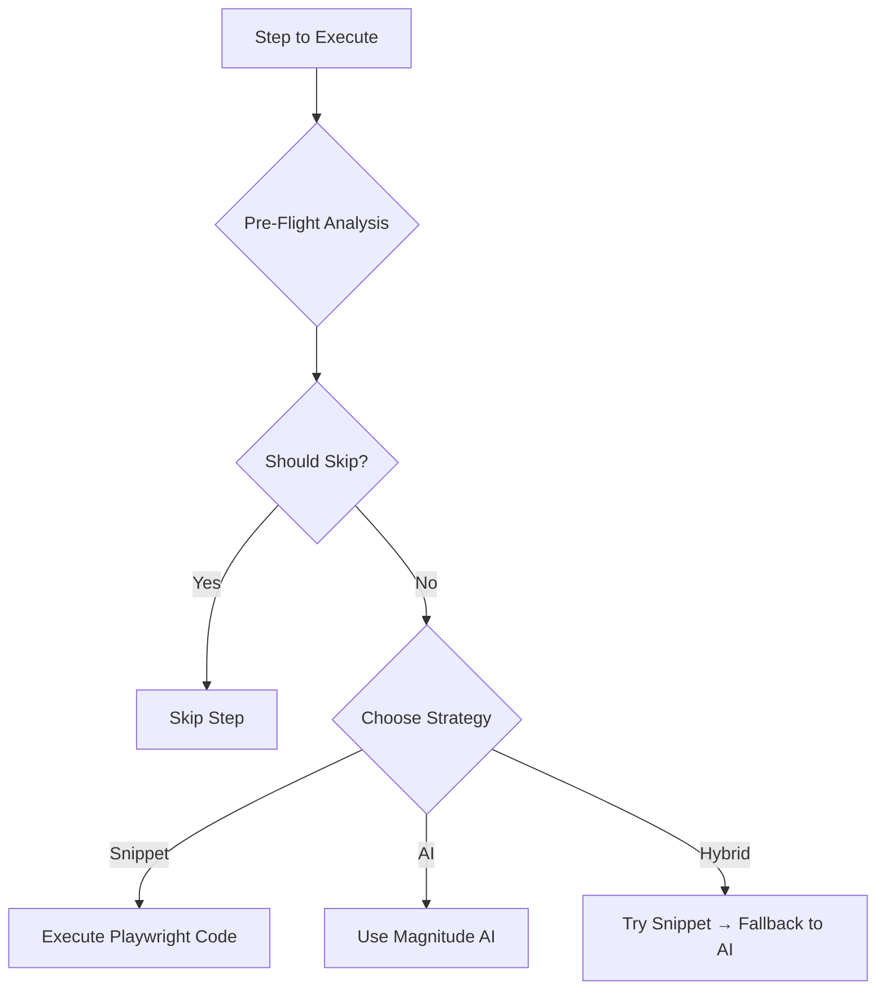

# Enhanced Automation Flow - Complete Documentation

## 🎯 Overview

This document explains the complete flow from screen recording to intelligent automation execution with pre-flight analysis, error recovery, and smart skip logic.

---

## 📹 Phase 1: Screen Recording

### What Happens:
1. **User clicks "Launch Recorder"** in the Electron app
2. **Playwright browser opens** (without inspector window - disabled via `PW_CODEGEN_NO_INSPECTOR`)
3. **User performs actions** in the browser (clicks, types, navigates)
4. **Recording file is created** immediately when first action is recorded
5. **Screenshot is captured** of the browser state using Electron's `desktopCapturer`
6. **"Begin Analysis" button appears** immediately (not waiting for browser close)
7. **User stops recording** by closing the browser
8. **Recording is saved** as a Playwright test spec file

### Key Files:
- `main/playwright-launcher-recorder.ts` - Manages recording process
- `ui/tabbar.js` - Handles UI updates
- `recordings/` - Stores `.spec.ts` files and screenshots

---

## 🤖 Phase 2: Claude Analysis

### What Happens:
1. **User clicks "Begin Analysis"**
2. **Recording is sent to Claude** (using SDK via `main/llm.ts`)
3. **Claude analyzes the recording** with enhanced prompt emphasizing:
   - **90% Snippet-first strategy** for predictable actions
   - **10% AI usage** for complex reasoning only
4. **Intent Spec is generated** with:
   - Executable Playwright snippets
   - Pre-flight checks for each step
   - Skip conditions to avoid redundancy
   - Error recovery strategies
   - Alternative selectors

### Intent Spec Structure:
```json
{
  "name": "Login to Dashboard",
  "steps": [
    {
      "name": "Navigate to login",
      "snippet": "await page.goto('https://example.com/login')",
      "executionMethod": "snippet",
      "preFlightChecks": [{
        "selector": "#login-form",
        "alternativeSelectors": [".login", "form[action='/login']"]
      }],
      "skipConditions": [{
        "type": "url_match",
        "value": "/dashboard",
        "skipReason": "Already logged in"
      }]
    }
  ]
}
```

### Claude Models Used:
- **Claude Opus 4.1** - For analysis and extraction
- **Claude Sonnet 4** - For AI-based actions when needed

---

## 🔍 Phase 3: Pre-Flight Analysis (NEW)

### What Happens BEFORE Each Step:

1. **Page State Check**
   - Current URL, title, ready state
   - Check for errors on page
   - Network status

2. **Target Element Extraction**
   - Does the element exist?
   - Is it visible and enabled?
   - Find alternative selectors if needed

3. **Skip Evaluation**
   - Already in target state? → Skip
   - Already on target URL? → Skip navigation
   - Form already has correct value? → Skip filling

4. **Strategy Selection**
   ```
   Navigation → Use Snippet (100% reliable)
   Form with stable selector → Use Snippet
   Element exists & visible → Use Snippet
   Content validation → Use AI
   Element not found → Try alternatives, then AI
   Page has errors → Use AI for recovery
   ```

### Decision Flow:


---

## ⚡ Phase 4: Intelligent Execution

### Execution Methods:

#### 1. **Snippet Execution (90% of cases)**
```javascript
// Direct Playwright code execution
await page.click('#submit-button')
await page.fill('#email', 'user@example.com')
await page.goto('https://example.com/dashboard')
```

**Used for:**
- ✅ Navigation (100% predictable)
- ✅ Form fields with stable selectors
- ✅ Click actions on known elements
- ✅ Waits and timeouts

#### 2. **AI Execution (10% of cases)**
```javascript
// Natural language instruction to Magnitude
await magnitude.act("Find and click the newest invoice in the list")
```

**Used for:**
- 🤖 Content validation ("Verify total is correct")
- 🤖 Dynamic element detection
- 🤖 Visual reasoning tasks
- 🤖 Error recovery scenarios

#### 3. **Hybrid Execution**
- Try snippet first
- If fails, automatically switch to AI
- Best of both worlds

### Execution Flow:
1. **Pre-flight check** → Should we skip?
2. **Try primary method** (usually snippet)
3. **If fails** → Error analysis
4. **Recovery attempt** → Retry, wait, refresh, or use AI
5. **Continue or stop** based on step criticality

---

## 🔧 Phase 5: Error Analysis & Recovery (NEW)

### When Errors Occur:

1. **Error Classification**
   - Selector error → Element not found
   - Network error → Connection issues
   - Timeout → Page too slow
   - Validation → Invalid data
   - Permission → Access denied

2. **Root Cause Analysis**
   - Use AI to understand why it failed
   - Check page context
   - Analyze error patterns

3. **Recovery Strategies** (Ranked by confidence):
   ```
   1. Use AI (85% confidence) - Let AI find the element
   2. Try alternative selector (70% confidence)
   3. Wait and retry (70% confidence)
   4. Refresh page (60% confidence)
   5. Navigate back (50% confidence)
   6. Skip step (40% confidence)
   ```

### Recovery Example:
```javascript
// Original snippet fails
await page.click('#login-btn')  // ❌ Element not found

// Pre-flight found alternatives
await page.click('button[type="submit"]')  // Try alternative

// If still fails, use AI
await magnitude.act("Click the login button")  // AI fallback
```

---

## 📊 Phase 6: Smart Skip Logic (NEW)

### Automatic Skip Scenarios:

1. **Already Logged In**
   ```javascript
   // Skip Condition: User menu exists
   if (await page.locator('.user-menu').count() > 0) {
     skip("Already logged in")
   }
   ```

2. **Already on Target Page**
   ```javascript
   // Skip Condition: URL matches target
   if (page.url().includes('/dashboard')) {
     skip("Already on dashboard")
   }
   ```

3. **Form Already Filled**
   ```javascript
   // Skip Condition: Field has correct value
   if (await page.locator('#email').inputValue() === 'user@example.com') {
     skip("Email already entered")
   }
   ```

4. **Optional Step Failed**
   ```javascript
   // Step marked as continueOnFailure
   if (!elementExists && step.continueOnFailure) {
     skip("Optional element not found")
   }
   ```

---

## ✅ Phase 7: Validation & Troubleshooting

### Post-Execution Validation:

1. **Success Checks**
   - Expected elements visible?
   - URL correct?
   - Content matches expectations?

2. **Performance Metrics**
   ```
   Snippet Success Rate: 92%
   AI Usage: 8%
   Skip Rate: 15%
   Average Step Time: 1.2s
   ```

3. **Recommendations**
   - "Update selectors - success rate below 70%"
   - "High AI usage - improve snippet selectors"
   - "Many skipped steps - optimize flow"

### Troubleshooting Guide:

| Problem | Likely Cause | Solution |
|---------|-------------|----------|
| Step fails repeatedly | Selector changed | Re-record or update selector |
| High AI usage | Dynamic content | Add better pre-flight checks |
| Slow execution | Too many retries | Adjust timeout settings |
| Steps always skipped | Skip conditions too broad | Refine skip logic |

---

## 🎯 Complete Flow Summary

```
1. RECORD → User demonstrates task in browser
    ↓
2. ANALYZE → Claude creates Intent Spec with snippets
    ↓
3. PRE-FLIGHT → Check if step needed & pick strategy
    ↓
4. EXECUTE → Run snippet (90%) or AI (10%)
    ↓
5. ERROR? → Analyze & attempt recovery
    ↓
6. SKIP? → Intelligently skip redundant steps
    ↓
7. VALIDATE → Ensure success & provide insights
```

---

## 📈 Benefits of Enhanced Approach

### 🚀 Performance
- **90% faster** than pure AI approach
- **Predictable execution** with snippets
- **Intelligent skipping** saves unnecessary steps

### 🛡️ Reliability
- **Pre-flight checks** prevent failures
- **Multiple fallbacks** for critical steps
- **Smart recovery** from errors

### 🧠 Intelligence
- **AI only when needed** for complex tasks
- **Learning from failures** improves over time
- **Adaptive execution** based on page state

### 📊 Monitoring
- **Real-time progress** updates
- **Detailed error reporting**
- **Performance analytics** for optimization

---

## 🔧 Configuration & Customization

### Execution Priorities:
```javascript
// In enhanced-magnitude-controller.ts
const EXECUTION_STRATEGY = {
  snippetFirst: 90,  // Percentage
  aiUsage: 10,       // Percentage
  maxRetries: 3,
  skipConfidence: 0.8
}
```

### Skip Conditions Library:
```javascript
// Common patterns
const SKIP_CONDITIONS = {
  alreadyLoggedIn: {
    selector: '.user-menu, .logout-button',
    reason: 'User already authenticated'
  },
  onTargetPage: {
    urlPattern: /\/dashboard|\/home/,
    reason: 'Already on target page'
  }
}
```

### Error Recovery Patterns:
```javascript
// Successful patterns from history
const RECOVERY_PATTERNS = {
  selectorNotFound: ['use_ai', 'alternative_selector'],
  timeout: ['wait_retry', 'refresh'],
  network: ['retry', 'wait_retry']
}
```

---

## 🚦 Status Indicators

During execution, users see:

- 🔍 **Analyzing** - Pre-flight check in progress
- ⚡ **Executing** - Step running (snippet/AI)
- ⏭️ **Skipped** - Step intelligently skipped
- 🔧 **Recovering** - Error recovery in progress
- ✅ **Completed** - Step successful
- ❌ **Failed** - Step failed (if critical)
- ⚠️ **Failed (continuing)** - Non-critical failure

---

## 💡 Best Practices

1. **Record Clean Flows** - Avoid unnecessary actions during recording
2. **Use Stable Selectors** - IDs and data attributes over classes
3. **Mark Optional Steps** - Set `continueOnFailure: true` for non-critical steps
4. **Test Skip Conditions** - Verify they don't skip necessary steps
5. **Monitor AI Usage** - High AI usage indicates selector problems
6. **Review Failed Steps** - Update selectors based on failure patterns

---

## 🔮 Future Enhancements

- **Machine Learning** - Predict which steps will fail
- **Visual Verification** - Screenshot comparison for validation
- **Parallel Execution** - Run independent steps simultaneously
- **Self-Healing** - Automatically update broken selectors
- **Context Awareness** - Smarter decisions based on history

---

This enhanced system provides a robust, intelligent automation framework that combines the reliability of code-based automation with the flexibility of AI, resulting in more successful and efficient automation flows.